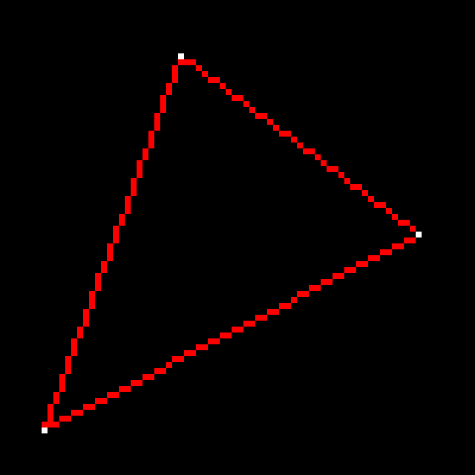
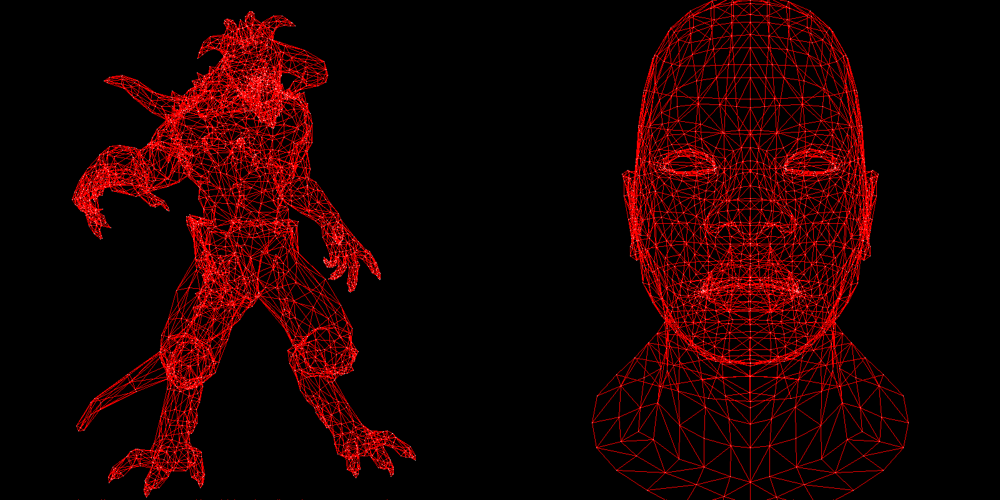
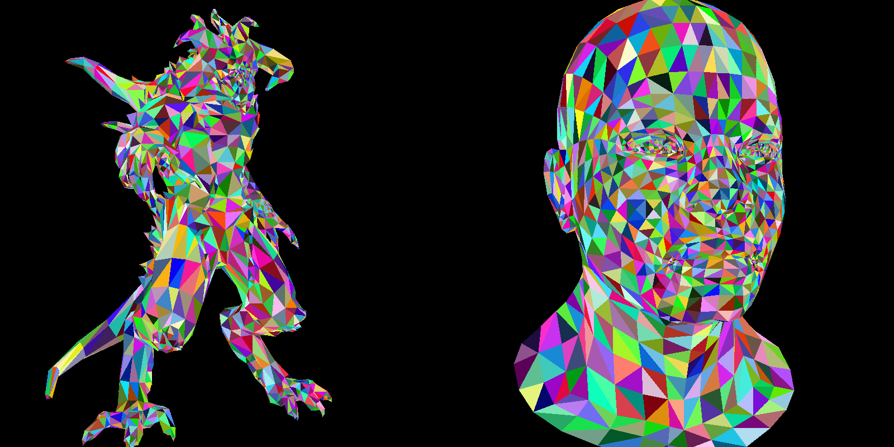
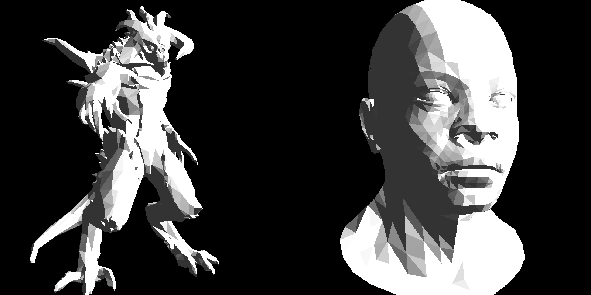
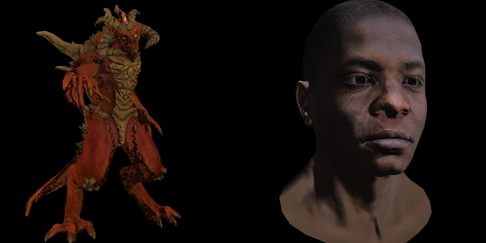

# tinyrenderer

A software rasterizer built from scratch in [Odin](https://odin-lang.org/), following [Ssloy's tinyrenderer course](https://github.com/ssloy/tinyrenderer). No graphics API, just beautiful maths to render a single 3D frame.

---

### 1. Wireframe

<p align="center"></p>



It all starts with a single triangle :: if you can draw one, you can draw a model.
Our input data are 3D models stored as `.obj` files, projected from model space (-1..1) -> screen space (0..width).

[Chapter 1: Bresenham's line drawing](https://haqr.eu/tinyrenderer/bresenham/)

---

### 2. Triangles Rasterization



To fill a triangle, it's helpful to think like a GPU and consider each pixel in isolation: "is this pixel inside the triangle?".
Sebastian Lague offers [this wonderful explanation](https://www.youtube.com/watch?v=HYAgJN3x4GA) of how to do this with `barycentric coordinates`.

We also make use of a depth buffer :: pixels closest to the camera take preference over pixels further away.

[Chapter 2: Triangle rasterization](https://haqr.eu/tinyrenderer/rasterization/)

---

### 3. Diffuse Lighting

At this point, I realized any further progress would be impossible without an understanding of linear algebra. 
I highly recommend [3Blue1Brown's Essence of Linear Algebra](https://www.youtube.com/watch?v=fNk_zzaMoSs&list=PLZHQObOWTQDPD3MizzM2xVFitgF8hE_ab) - it's the simplest *visual* explanation of how coordinate space can be transformed with simple maths.



After this detour, I wrote my own linear algebra layer :: dot products, cross products, matrix multiplication, normalization, and most importantly: matrix composition.

Matrix composition allows us to compose any rotation or transformation into a single matrix applied to every coordinate. It also means we can implement camera movement. 

[Chapter 6: by far the most interesting part of ssloy's course](https://haqr.eu/tinyrenderer/camera/).

---

### 4. Texture Maps


Texture maps are a way to encode 3D textures into a 2D format, analogous to laying a cloth flat on the ground, then dropping it over a 3D object. 

The magic of `barycentric coordinates` again comes into play when mapping 3D coordinates to its corresponding 2D texture.

[Chapter 8: Texture mapping](https://haqr.eu/tinyrenderer/textures/)

---

### 5. The final result



Feast your eyes!

---

## Build

```sh
git clone https://github.com/Mr-Robot-err-404/tinyrenderer.git
cd tinyrenderer
odin run . -- <stage> [--asset head|monster] [--light] [--specular]
```

**Stages:** `wireframe` · `flat` · `smooth` · `texture`

**Flags:** `--asset head|monster` · `--light` · `--specular`

---

## Credit

Course and original C++ implementation by [Ssloy](https://github.com/ssloy/tinyrenderer). Models included from his repository. This is a learning project :: the implementation is my own, the pedagogy is his.
